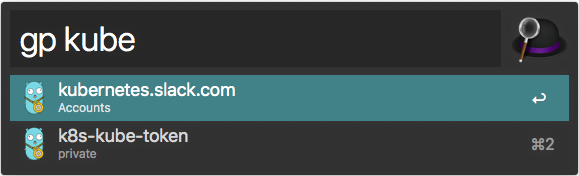

# Gopass-Alfred

Workflow to interact with gopass from Alfred 3. 
Currently querying entries and copying username or password to clipboard is supported.
## Screenshot

## Installation

Download the latest package from github or build zip file via `make release` in checked out repository.

